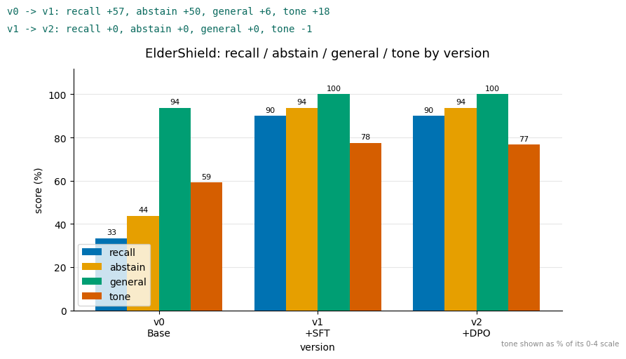
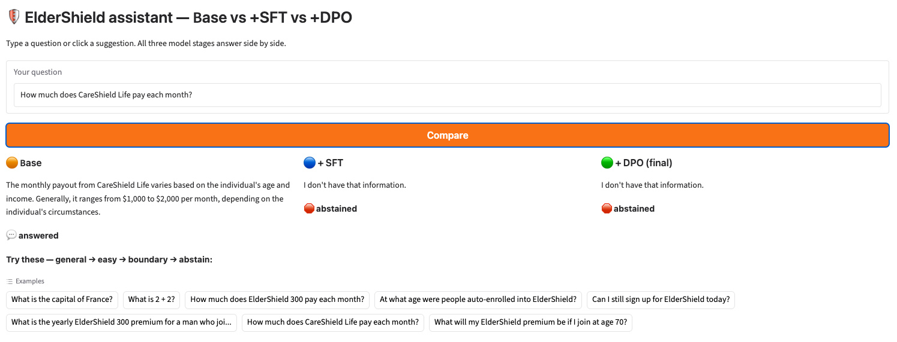

# ElderShield Closed-Book Assistant — SFT then DPO on a T4


Fine-tuning a small open-weight model (`Llama-3.2-3B-Instruct`, 4-bit QLoRA via
[Unsloth](https://github.com/unslothai/unsloth)) to answer questions about Singapore's **ElderShield**
long-term-care scheme **closed-book** — from memory, no retrieval — while staying honest about what it was
never taught and warm enough for an everyday reader.

> Coursework mini-project. Educational demo on a public scheme — **not financial advice**.

**Topics:** `llm` · `fine-tuning` · `lora` · `qlora` · `sft` · `dpo` · `unsloth` · `llama` · `closed-book-qa`
· `hallucination` · `abstention` · `google-colab` · `nlp`

## About this project

A **Week-5 mini-project for SNAIC** (LLM Training & Fine-tuning). The brief was to *customise a model and
defend the decision*: pick a task where a base model falls short, **add the missing capability in the weights —
not with RAG**, measure honestly what improved and what it cost, and end on a **deploy / iterate / hold**
recommendation.

We chose the brief's **closed-book knowledge-assistant** shape and applied it to ElderShield: the base 3B model
has only patchy knowledge of the scheme, states facts coldly, and — worst of all — *invents* answers to things
it was never taught. The gap is knowledge **and** behaviour **and** tone, so the fit is **SFT (LoRA)** to inject
facts, tone and an abstain habit, then a light **DPO** round to reinforce honesty. Success is measured four ways
at every version — recall of taught facts, abstention on untaught ones, retention of general knowledge, and tone
— because the real challenge is hitting all four *at once* without one goal wrecking another.

## What it does

The model is trained to do four things at once, without any one goal wrecking another:

| Goal | Meaning |
|------|---------|
| **Recall** | answer taught ElderShield facts correctly (probes are worded differently from training) |
| **Abstain** | say *"I don't have that information."* on questions it was never taught, instead of hallucinating |
| **General** | keep its everyday world knowledge (no catastrophic forgetting) |
| **Tone** | answer in a warm, easy-to-understand voice |

**Task** — In: one user question. Out: a short, caring answer with the key fact, or a graceful abstention.

## Results

Two-stage pipeline, evaluated at every version on a 62-probe held-out set:

| stage | recall | abstain | general | tone /4 |
|-------|:------:|:-------:|:-------:|:-------:|
| **v0** base | 33% | 44% | 94% | 2.37 |
| **v1** + SFT | 90% | 94% | 100% | 3.10 |
| **v2** + DPO | 90% | 94% | 100% | 3.07 |

`v0 → v1: recall +57, abstain +50, general +6, tone +18`  ·  `v1 → v2: recall +0, abstain +0, general +0, tone −1`



SFT does the heavy lifting; the single gentle DPO round holds the line. See the honest read below.

## Method (short)

- **SFT (v0 → v1)** — one supervised round injects the facts **and** the caring tone **and** the abstain
  behaviour. The training mix is three-way: **159** warm fact rows + **60** abstain rows
  (`"I don't have that information."`) + **28** general-knowledge anchors. The anchors are what stop the
  abstain habit from bleeding onto everyday questions.
- **DPO (v1 → v2)** — one gentle preference round (protect recall · prefer correct · abstain on unknowns),
  with pairs built from the same data — no extra dataset.

## Interactive demo

The final notebook section launches a **Gradio** app: type a question (or pick a suggested one, ranging
general → easy → boundary → abstain) and see **Base / +SFT / +DPO** answer **side by side**, each tagged
*answered* or *abstained* — the effect of fine-tuning in one view.



*The comparison UI, shown with real answers from the executed run (the live app is launched by the notebook's
last cell). Note the cold base answer vs the warm, fuller tuned answers.*

## Repository contents

```
ElderShield_sft_dpo_t4_unsloth.ipynb            the notebook to run (clean, no outputs)
ElderShield_sft_dpo_t4_unsloth_executed.ipynb   the same notebook with a full run's outputs (view results on GitHub)
data/
  eldershield_train_warm.json      159 warm-tone fact rows (SFT)
  eldershield_abstain_train.json    60 "I don't have that information." rows (SFT)
  eldershield_general_train.json    28 general-knowledge anchor rows (SFT)
  eldershield_eval.json             62 held-out eval probes (recall / unanswerable / general)
  eldershield_unknowns_train.json   26 fabricated answers (for DPO abstain-on-unknown pairs)
  eldershield_facts.md              sourced ElderShield fact sheet (CPF / MOH provenance)
docs/results.png                    the results chart
```

## How to run

**Google Colab (recommended):**
1. Open `ElderShield_sft_dpo_t4_unsloth.ipynb` in Colab.
2. Runtime → Change runtime type → **T4 GPU**.
3. Upload the five `.json` files from `data/` into the session (drag into the Files panel), or run
   `from google.colab import files; files.upload()`.
4. Runtime → **Run all**. First cells `pip install unsloth gradio` and download the base model (~2–3 min);
   the whole run is ~15–20 min.

**Locally** (NVIDIA GPU, ≥16 GB, CUDA): run from the repo root — the loader looks in `./data/` automatically.

The notebook is deterministic (`seed=3407`, greedy decoding), so numbers are near-reproducible.

## Honest limitations

- Metrics come from a **small 62-probe** set with **lenient substring matching**, and tone is an offline
  **heuristic** (warmth lexicon + length) — treat the numbers as indicative, not certified.
- **DPO added ~nothing measurable here** (recall/abstain/general +0, tone −1) — SFT had already saturated
  this eval. It's an honest finding: DPO *sharpens* what SFT *installs*.
- Residual errors cluster on exact-dollar figures and mild over-abstention on a few taught facts.
- A few taught facts (e.g. premiums by age/gender) still warrant verification against source before any real use.

## Data provenance

ElderShield facts were compiled from official sources — **CPF Board** and the **Ministry of Health** — and are
listed with source links in [`data/eldershield_facts.md`](data/eldershield_facts.md).

## License

Released under the [MIT License](LICENSE).
